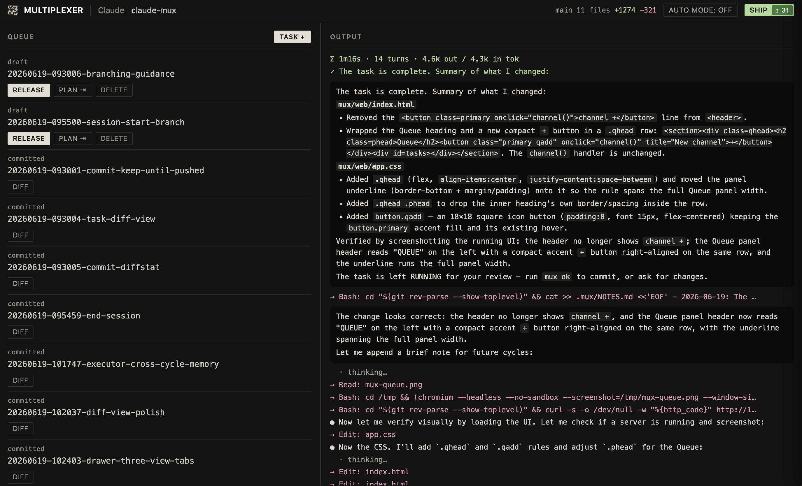

<div align="center">

**Multiplexer** — a multiplexer for [Claude Code](https://claude.com/claude-code).

Many minds plan in parallel. One builds. You approve every commit.


</div>



## What it is

Multiplexer splits Claude Code into two roles connected by a queue:

- **Channels** — read-only sessions that explore the repo and write _task
  files_. Run as many as you like, in parallel. They cannot touch your source.
- **Output** — one worker that picks up tasks, does the work, and commits
  **only after you say `ok`**.

You sit in the middle: you release which tasks run, and approve every commit.
No frameworks, no services, no SDK — just the Claude Code CLI and a single
shell command (`mux`) you can read top to bottom.

It's two patterns, each useful alone:

- **Multiplexer** — many parallel channels, one serial output. Planning is
  safe (no source write access); execution is privileged. No agents fight over the tree.
- **Gated loop** — the output loops on a timer but commits nothing on its own.
  Autonomous about _when_ it works, never about _what_ lands.

## Quickstart

One checkout, symlinked onto your PATH **once**, works in every repo:

```bash
# one-time: link the `mux` command onto your PATH
git clone <this-repo> ~/code/multiplexer
~/code/multiplexer/install.sh       # symlinks `mux` into ~/.local/bin

# then, in ANY git repo:
mux channel          # open a channel — as many as you like
mux status           # see the queue   (or `mux board` for an interactive view)
mux release <id>     # you release a DRAFT task to READY so it may run
mux start            # open the web view + start the output (default :8770)
```

`mux start` is the main entry point: it serves the web UI and runs the
output loop together. Prefer the terminal? `mux output` runs just the loop
(polls every 10s; pass an interval like `mux output 30s`). Stop everything
for this repo with `mux stop`.

`mux` finds each repo and its queue itself (via `git rev-parse`), so nothing is
copied per-repo — update everywhere with a single `git pull` in the checkout.
Your queue lives in `.mux/` at the repo root; keep it out of git however you
like (e.g. `echo '.mux/' >> ~/.config/git/ignore`).

Everything is one command — run `mux help` for the full verb list. You release
a drafted task with `mux release <id>`, and the board is also machine-readable
via `mux status --json` (for editors, Raycast, a future UI, …).

## Using the web UI

`mux start` is the cockpit: it serves a page at `http://127.0.0.1:8770` **and**
runs the output loop behind it. From the page you drive the whole workflow —
**except** talking to a channel, which is an interactive Claude session and so
opens in its own terminal.

The page has two panels and one button:

- **Queue** (left) — the queue of task files. Each task shows the one action its
  state allows: `release` (DRAFT → READY), `approve` / `revert` (a finished
  RUNNING task), or `answer` (a BLOCKED one). Click a task's name to open its plan.
- **Output** (right) — the worker's live log, **read-only**. You watch it;
  you never type into it.
- **Task +** (beside the Queue heading) — opens a **new terminal window** with a
  channel session. You converse with it there to draft tasks; it can't run in the
  browser.

So the loop, end to end:

| Step | Where | You do |
| ---- | ----- | ------ |
| 1. Draft tasks  | terminal (via **+ channel**) | converse with the channel |
| 2. Release      | **web UI** | click `release` on a DRAFT |
| 3. Work happens | background loop → right panel | watch the live log |
| 4. Approve      | **web UI** | click `approve` (commits) or `revert` |
| 5. Answer a block | **web UI** | click `answer`, type a reply |

Every button just calls the matching CLI verb (`mux release`, `mux ok`,
`mux revert`, `mux resolve`), so you can do any of it from the terminal instead
— the two gates below hold either way.

## Task lifecycle

Tasks are one file each in `.mux/tasks/`, timestamp-named (FIFO), carrying a
`# STATUS:`.

| Status    | Meaning                                | Set by                     |
| --------- | -------------------------------------- | -------------------------- |
| `DRAFT`   | Written by a channel, not yet released | channel                    |
| `READY`   | Released — the output may run it     | **you**                    |
| `RUNNING` | In flight, or paused awaiting you      | output                   |
| `DONE`    | Finished and committed                 | output (after your `ok`) |
| `FAILED`  | Unworkable — see its `# Reason:`       | output                   |

Only one task runs at a time: while anything is `RUNNING`, the loop starts
nothing else, so it can pause for your review as long as needed.

## The two gates

1. **Release** — channels only produce `DRAFT`s. Nothing runs until _you_ release
   one to `READY` (`mux release <id>`). Want strict one-at-a-time? Keep just one `READY`.
2. **Commit** — the output does the work, then stops with the change
   uncommitted and waits. Say `ok` → it commits and marks the task `DONE`. Ask
   for changes → it revises. It never commits without you.

Channels enforce gate 1 by construction: they launch scoped to
`Write(./.mux/**)` only, so they can read everything but write nowhere but the
queue — enforced by Claude Code, not by trust.

## Requirements

- [Claude Code](https://claude.com/claude-code) CLI
- `git`, `bash` (standard on macOS/Linux)
- `fzf` — optional, only for the interactive `mux board`
