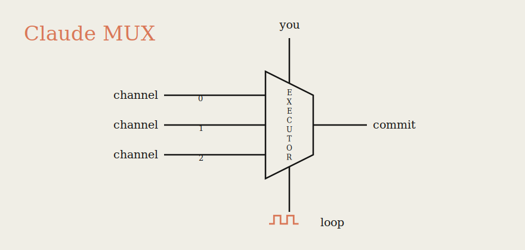

<div align="center">

**A multiplexer for [Claude Code](https://claude.com/claude-code).**

Many minds plan in parallel. One builds. You approve every commit.


</div>

## What it is

Claude MUX splits Claude Code into two roles connected by a queue:

- **Planners** — read-only sessions that explore the repo and write _task
  files_. Run as many as you like, in parallel. They cannot touch your source.
- **Executor** — one worker that picks up tasks, does the work, and commits
  **only after you say `ok`**.

You sit in the middle: you release which tasks run, and approve every commit.
No frameworks, no services, no SDK — just the Claude Code CLI and a few shell
scripts you can read top to bottom.

It's two patterns, each useful alone:

- **Multiplexer** — many parallel planners, one serial executor. Planning is
  safe (no write access); execution is privileged. No agents fight over the tree.
- **Gated loop** — the executor loops on a timer but commits nothing on its own.
  Autonomous about _when_ it works, never about _what_ lands.

## Quickstart

```bash
# install into any git repo you work in:
./install.sh /path/to/your/repo

# then, in that repo:
.claude/mux/executor.sh     # the worker (loops every 5m; pass an interval to change)
.claude/mux/planner.sh      # a planner — open as many as you like
.claude/mux/status.sh       # see the queue
```

Everything lands in `.claude/mux/` and is hidden via `.git/info/exclude`, so it's
never tracked, committed, or seen by teammates. Re-run `install.sh` to update; it
won't touch your queue.

## Task lifecycle

Tasks are one file each in `.mux/tasks/`, timestamp-named (FIFO), carrying a
`# STATUS:`.

| Status    | Meaning                                | Set by                     |
| --------- | -------------------------------------- | -------------------------- |
| `DRAFT`   | Written by a planner, not yet released | planner                    |
| `READY`   | Released — the executor may run it     | **you**                    |
| `RUNNING` | In flight, or paused awaiting you      | executor                   |
| `DONE`    | Finished and committed                 | executor (after your `ok`) |
| `FAILED`  | Unworkable — see its `# Reason:`       | executor                   |

Only one task runs at a time: while anything is `RUNNING`, the loop starts
nothing else, so it can pause for your review as long as needed.

## The two gates

1. **Release** — planners only produce `DRAFT`s. Nothing runs until _you_ flip a
   task to `READY`. Want strict one-at-a-time? Keep just one `READY`.
2. **Commit** — the executor does the work, then stops with the change
   uncommitted and waits. Say `ok` → it commits and marks the task `DONE`. Ask
   for changes → it revises. It never commits without you.

Planners enforce gate 1 by construction: they launch scoped to
`Write(./.mux/**)` only, so they can read everything but write nowhere but the
queue — enforced by Claude Code, not by trust.

## Requirements

- [Claude Code](https://claude.com/claude-code) CLI
- `git`, `uuidgen`, `bash` (standard on macOS/Linux)
